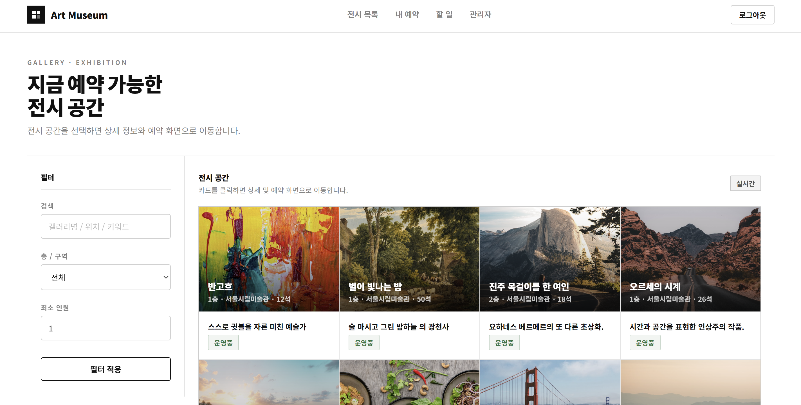
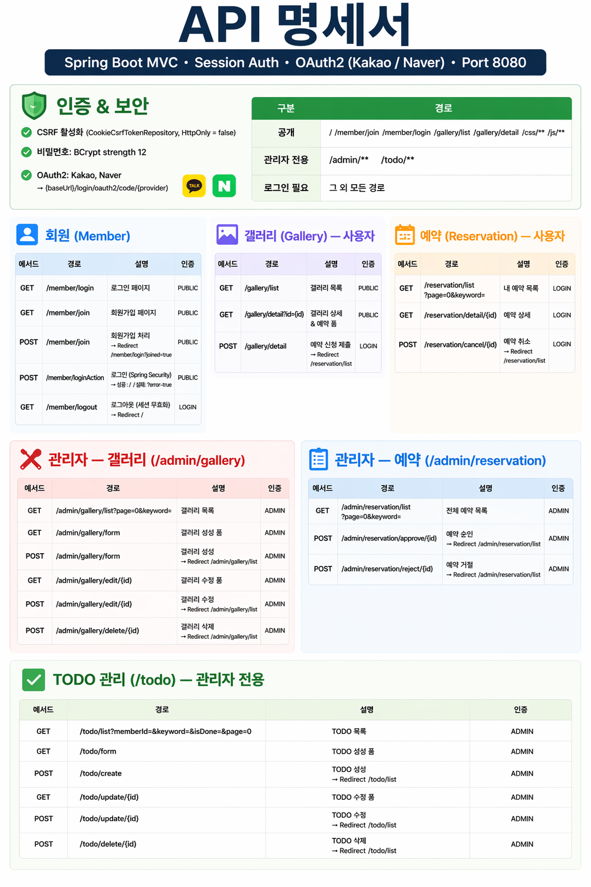
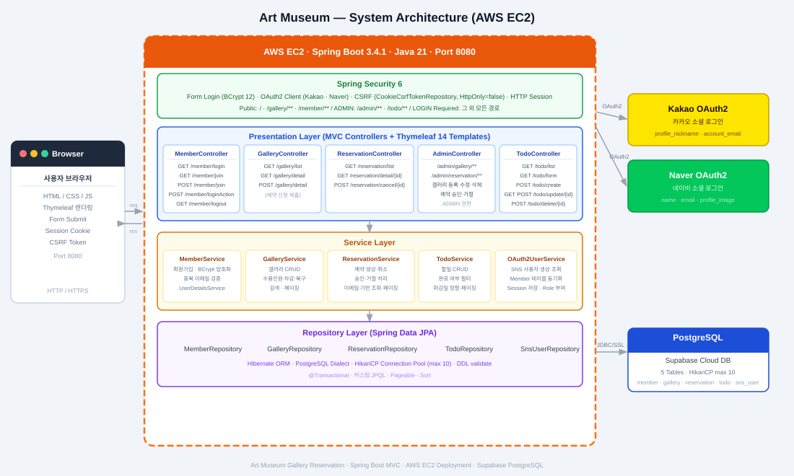

# 🖼️ Gallery Reservation

미술관 갤러리 예약 및 관리 웹 애플리케이션입니다.
사용자는 갤러리를 조회하고 예약을 신청할 수 있으며, 관리자는 갤러리와 예약을 관리할 수 있습니다.

---

## 📌 주요 기능

### 👤 회원

- 일반 회원가입 / 로그인
- **소셜 로그인** (카카오, 네이버)
- 일반 로그인 / 소셜 로그인 모두 동일한 기능 이용 가능

### 🗓️ 예약

- 갤러리 예약 신청 (날짜, 시간 선택)
- 내 예약 목록 조회
- 예약 취소
- 예약 상태: `대기중 → 승인 / 거절 / 취소`

### ✅ 할 일 (Todo)

- 개인 할 일 등록 / 수정 / 삭제
- 완료 여부, 마감일 관리
- 키워드 검색 및 완료 여부 필터링

### 🏛️ 갤러리 (관리자)

- 갤러리 등록 / 수정 / 비활성화
- 층/구역 정보, 수용 인원, 운영 시간 관리
- 예약 승인 / 거절 처리

---

## 🛠️ 기술 스택

| 분류      | 기술                              |
| --------- | --------------------------------- |
| Language  | Java 21                           |
| Framework | Spring Boot 3.4.1                 |
| ORM       | Spring Data JPA                   |
| View      | Thymeleaf                         |
| Security  | Spring Security 6 + OAuth2 Client |
| Database  | PostgreSQL (Supabase)             |
| Build     | Gradle                            |
| Etc       | Lombok                            |

---

### 👥 서비스 대상

- 미술관 갤러리 공간을 대관하고 싶은 사람들
- 전시 공간을 편리하게 예약하고 싶은 사람들

---

## 🛠 기술 스택

### Backend

<p>
  
  
  
  
  
  
</p>

### Database

<p>
  
</p>

### Build & Infra

<p>
  
  
</p>

---

## 💌 서비스 화면 및 기능 소개

### ✅ 메인


---

### ✅ 회원

- **회원가입 / 로그인**

  > 이메일과 비밀번호로 회원가입 및 로그인할 수 있다.

- **소셜 로그인**
  > 카카오, 네이버 OAuth2 소셜 로그인을 지원한다.


---

### ✅ 갤러리 조회

- **갤러리 목록 조회**

  > 전체 갤러리 목록을 커버 이미지, 위치, 수용 인원과 함께 확인할 수 있다.

- **갤러리 상세 조회 및 예약 신청**
  > 갤러리 상세 페이지에서 날짜, 30분 단위 시간 슬롯, 인원, 연락처를 선택해 바로 예약 신청할 수 있다.



---

### ✅ 예약 관리

- **내 예약 목록 조회**
  > 신청한 예약 목록을 페이지네이션과 갤러리명 검색으로 조회할 수 있고, 대기 중인 예약을 취소 신청할 수 있다.


> `대기중 → 승인 / 거절 / 취소`

- **예약 상세 조회**
  > 갤러리 커버 이미지와 함께 예약 정보를 상세하게 확인할 수 있다.


---

### ✅ 관리자 페이지

- **갤러리 관리**
  > 갤러리 등록, 수정, 삭제 및 운영 상태(운영중/비활성화)를 관리할 수 있다.


- **갤러리 등록**
  > 갤러리 등록, 수정, 삭제 및 운영 상태(운영중/비활성화)를 관리할 수 있다.


- **갤러리 수정**
  > 갤러리 등록, 수정, 삭제 및 운영 상태(운영중/비활성화)를 관리할 수 있다.


- **예약 승인/거절**
  > 전체 예약 목록을 조회하고 예약을 승인하거나 거절할 수 있다.


---

### ✅ 할일 페이지

- **할일 등록/수정**
  > 전체 예약 목록을 조회하고 예약을 승인하거나 거절할 수 있다.


---

## 📡 API 명세



---

## 🏗 시스템 아키텍처



---

## 🗂 프로젝트 구조

```
src/main/java/com/study/galleryreservation/
├── config/                         # 설정 클래스
│   ├── SecurityConfig.java         # Spring Security 설정
│   ├── CustomAuthenticationSuccessHandler.java
│   └── OAuthAttributes.java        # OAuth2 속성 매핑
│
├── controller/                     # 컨트롤러
│   ├── AdminController.java        # 관리자 전용 (갤러리 관리, 예약 승인)
│   ├── GalleryController.java      # 갤러리 상세 / 예약 신청
│   ├── MemberController.java       # 회원가입 / 로그인
│   ├── ReservationController.java  # 예약 신청 / 조회 / 취소
│   ├── TodoController.java         # 할 일 CRUD
│   └── ViewController.java         # 공통 뷰 라우팅
│
├── domain/                         # 엔티티
│   ├── gallery/Gallery.java
│   ├── member/Member.java
│   ├── member/MemberRole.java
│   ├── reservation/Reservation.java
│   ├── reservation/ReservationStatus.java
│   ├── session/SessionUser.java
│   ├── session/SnsUser.java
│   ├── session/UserRole.java
│   └── todo/Todo.java
│
├── dto/                            # DTO
│   ├── gallery/
│   ├── member/
│   ├── reservation/
│   └── todo/
│
├── repository/                     # JPA 레포지토리
│   ├── GalleryRepository.java
│   ├── MemberRepository.java
│   ├── ReservationRepository.java
│   ├── SnsUserRepository.java
│   └── TodoRepository.java
│
└── service/                        # 서비스
    ├── CustomOAuth2UserService.java
    ├── CustomUserDetailsService.java
    ├── GalleryService.java
    ├── MemberService.java
    ├── ReservationService.java
    └── TodoService.java

src/main/resources/
├── templates/
│   ├── index.html                  # 메인 페이지
│   ├── admin/                      # 관리자 페이지
│   ├── gallery/                    # 갤러리 목록/상세
│   ├── member/                     # 로그인/회원가입
│   ├── reservation/                # 예약 폼/목록
│   └── todo/                       # 할 일 폼/목록/수정
├── application.yml
└── db.sql                          # 테이블 DDL
```

---

## 🗄️ ERD

```
member (1) ──────< todo (N)
member (1) ──────< reservation (N)
gallery (1) ─────< reservation (N)
```

| 테이블      | 주요 컬럼                                                                 |
| ----------- | ------------------------------------------------------------------------- |
| member      | id, username, password, email, role, created_at                           |
| gallery     | id, name, location, floor_zone, capacity, is_active                       |
| reservation | id, member_id, gallery_id, reservation_date, start_time, end_time, status |
| todo        | id, member_id, title, content, is_done, due_date                          |

---

## 🔐 권한 구조

| 역할         | 접근 가능 기능                           |
| ------------ | ---------------------------------------- |
| `ROLE_USER`  | 갤러리 조회, 예약 신청/취소              |
| `ROLE_ADMIN` | 모든 기능 + 갤러리 관리 + 예약 승인/거절 |

---

## 🔑 소셜 로그인

카카오, 네이버 OAuth2 로그인을 지원합니다.
소셜 로그인 최초 시 Member 테이블에 자동으로 회원 등록되며, 이후 일반 로그인 회원과 동일하게 서비스를 이용할 수 있습니다.

| Provider | username 형식        |
| -------- | -------------------- |
| 카카오   | `kakao_{providerId}` |
| 네이버   | `naver_{providerId}` |

---

## ⚙️ 실행 방법

### 1. 환경 변수 / application.yml 설정

```yaml
spring:
  datasource:
    url: jdbc:postgresql://{supabase_host}:5432/postgres
    username: postgres
    password: { your_password }
  security:
    oauth2:
      client:
        registration:
          kakao:
            client-id: { kakao_client_id }
            client-secret: { kakao_client_secret }
          naver:
            client-id: { naver_client_id }
            client-secret: { naver_client_secret }
```

### 2. 데이터베이스 초기화

```sql
-- src/main/resources/db.sql 실행
```

### 3. 빌드 및 실행

```bash
./gradlew bootRun
```

브라우저에서 `http://localhost:8080` 접속

---

## 📄 주요 URL

| URL                       | 설명                 |
| ------------------------- | -------------------- |
| `/`                       | 메인 페이지          |
| `/member/join`            | 회원가입             |
| `/member/login`           | 로그인               |
| `/gallery/list`           | 갤러리 목록          |
| `/reservation/form`       | 예약 신청            |
| `/reservation/list`       | 내 예약 목록         |
| `/todo/list`              | 할 일 목록           |
| `/todo/form`              | 할 일 등록           |
| `/admin/gallery/list`     | 갤러리 관리 (관리자) |
| `/admin/gallery/form`     | 갤러리 등록 (관리자) |
| `/admin/reservation/list` | 예약 관리 (관리자)   |
